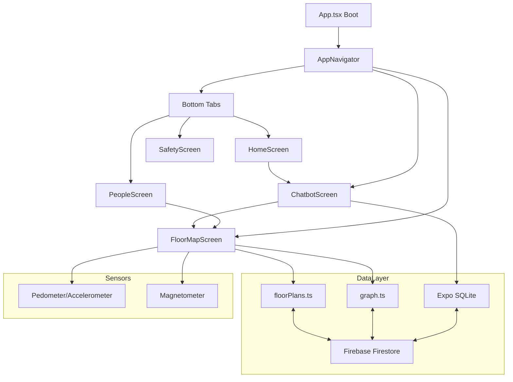

# Campus Navigator S2 - Project Documentation

## Overview
Campus Navigator S2 is an Expo React Native app for indoor navigation. It uses
SVG floor plans, a coordinate graph, and sensor-based tracking to guide users.
It also includes a directory chatbot that uses local data synced from Firebase
and falls back to Gemini for general questions.

## Tech Stack
**Framework / UI**
- React Native (Expo): rapid mobile development with managed native capabilities.
- TypeScript: safer refactors and reliable typing for data models and services.
- React Navigation (Stack + Bottom Tabs): split onboarding vs. main tabs, and allow deep links to map/chat.
- React Native SVG: renders the floor plans as vector paths that can be zoomed.

**State & Data**
- Zustand: lightweight global state for current position, building, floor.
- Expo SQLite: local offline cache for people/rooms directory.
- Firebase Firestore: cloud sync for personnel + map data (graph + floor plans).

**Sensors & Location**
- Expo Sensors: pedometer/accelerometer + magnetometer for indoor movement.
- Gemini API: fallback for general questions not tied to the directory.

## Architecture

### High-Level Modules
- UI Screens: `src/screens/*.tsx`
- Navigation: `src/navigation/AppNavigator.tsx`
- Data Models: `src/data/graph.ts`, `src/data/floorPlans.ts`
- Services: `src/services/*`
- State Store: `src/stores/appStore.ts`
- Database: `src/db/database.ts`

### Architecture Diagram (Mermaid)

### App Boot Flow
File: `App.tsx`
1) Initialize SQLite
2) Seed local DB only if empty
3) Optionally upload local personnel to Firestore
4) Sync personnel from Firestore
5) Sync map data from Firestore (optional)
6) If map data is empty and seeding is enabled, upload local map and re-sync

### Navigation Structure
File: `src/navigation/AppNavigator.tsx`
- Stack: `BuildingSelector` -> `Main` -> `FloorMap` / `RouteView` / `Chatbot`
- Tabs: `HomeScreen`, `PeopleScreen`, `SafetyScreen`

## Data Flow

### Personnel Data
- Source of truth: Firestore (optional)
- Local cache: SQLite (`personnel` table)
- Sync:
  - Cloud -> Local: `syncPersonnelFromCloud()`
  - Local -> Cloud: `uploadLocalPersonnelToCloud()`

### Map Data (Graph + Floor Plans)
- Local fallback: `src/data/graph.ts`, `src/data/floorPlans.ts`
- Cloud source:
  - Graph: `mapData/graph`
  - Floor plans: `floorPlans/{floorNumber}`
- Sync:
  - Cloud -> Local: `syncMapDataFromCloud()`
  - Local -> Cloud: `uploadLocalMapDataToCloud()`

### Runtime Position
- Position uses pedometer or accelerometer fallback.
- Heading uses magnetometer for rotation.
- Path drawing uses corridor-based routing.

## Chatbot Behavior
File: `src/screens/ChatbotScreen.tsx`

**Directory First**
1) User message is checked against local directory (SQLite).
2) If found:
   - Responds with building + office.
   - Stores a pending target for navigation.
3) If user replies "yes" / "navigate":
   - Opens `FloorMap` with nodeId.

**Safety**
- Emergency and security questions return fixed responses.

**Non-directory Queries**
- Gemini is used only for general questions to avoid hallucinations.
- Location queries that are not found return a "not found" response.

## Firebase Integration
Files:
- `src/config.ts`
- `src/services/firebase.ts`
- `src/services/personnelSync.ts`
- `src/services/mapSync.ts`

### Firestore Schema
**Personnel**
Collection: `personnel`
Doc ID: `nodeId`
Fields: `name`, `role`, `office`, `floor`, `building`, `nodeId`

**Map Graph**
Doc: `mapData/graph`
Field: `nodes` (array of `{ id, x, y, floor }`)

**Floor Plans**
Collection: `floorPlans`
Doc ID: floor number (e.g. `0`, `1`)
Field: `svg` (string)

## Gemini Integration
Files:
- `src/config.ts`
- `src/services/llm.ts`

**How it works**
- Direct call to Gemini `generateContent` API.
- Used only when directory lookup fails and query is not a location request.

**Config**
- `geminiApiKey`
- `geminiModel` (default: `gemini-2.5-flash`)

## Configuration
File: `src/config.ts`

- `seedCloudOnStart`
  - Upload local personnel to Firestore (one-time)
- `syncMapOnStart`
  - Pull graph + floor plans from Firestore on launch
- `seedMapOnStart`
  - If cloud map is empty, push local graph + floor plans

Recommended flow:
1) `seedMapOnStart = true` for first seed
2) Set back to `false` after seeding
3) Keep `syncMapOnStart = true`

## Key Files
- `App.tsx` (boot flow)
- `src/config.ts` (keys + sync flags)
- `src/services/llm.ts` (Gemini calls)
- `src/services/personnelSync.ts` (personnel sync)
- `src/services/mapSync.ts` (graph + floor plan sync)
- `src/data/graph.ts` (local graph fallback + runtime override)
- `src/data/floorPlans.ts` (local SVGs + runtime override)
- `src/screens/ChatbotScreen.tsx` (chat flow)

## Run / Develop
- Install: `npm install`
- Start: `npm run start`
- Platforms: `npm run android`, `npm run ios`, `npm run web`

## Testing Checklist
### Personnel
1) Add a person in Firestore `personnel`.
2) Start app.
3) Ask chat: "Principal" -> should answer from directory.
4) Reply "navigate" -> opens map.

### Map Data
1) Set `seedMapOnStart = true`, `syncMapOnStart = true`.
2) Start app once.
3) Verify Firestore has `mapData/graph` and `floorPlans/*`.
4) Set `seedMapOnStart = false`.

### Gemini
1) Ask: "Tell me a joke" -> should respond from Gemini.

## Known Caveats
- Gemini is not used for directory answers to avoid hallucinations.
- Map sync overrides in-memory data only; local files remain fallback.
- If Firestore is empty and seeding is off, local data remains active.

## Sensors and Indoor Navigation Notes

### Why we use sensors instead of GPS
- **GPS is unreliable indoors**: walls and floors attenuate signals and cause drift.
- **Floor-level precision is not possible** with standard GPS on most phones.
- **Floor plans are not geo‑coded**: our maps are local coordinate systems (SVG pixels).

### Sensors used
- **Pedometer / Accelerometer**
  - Tracks steps to estimate distance along the corridor path.
  - Allows movement progress without GPS.
- **Magnetometer**
  - Provides heading for the directional arrow on the map.
  - Improves user orientation in the SVG plan.

### How this ties to the map
- The map uses a fixed coordinate system (SVG pixels).
- The route is a polyline built from corridor coordinates + target nodes.
- Steps translate into distance along the polyline (pixels -> meters via scale factor).

## Enhancement Option: AR Mode (Camera Overlay)
This option keeps Expo managed workflow and does not require ARKit/ARCore.

### What it is
- A camera-based overlay that shows directional arrows and distance cues.
- Uses existing routing + sensors to simulate AR guidance.

### Open-source components
- `expo-camera` (live camera feed)
- `expo-sensors` (magnetometer + accelerometer)
- `react-native-svg` (overlay arrows/text)

### How it would work
1) Add a new screen `ARModeScreen.tsx` with `CameraView`.
2) Subscribe to heading from `useMagnetometer` and steps from `initPedometer`.
3) Reuse `routing.ts` to get the path polyline.
4) Compute next turn and distance remaining.
5) Render an arrow overlay rotated to the next direction.
6) Show text like “Go straight for 12 m” or “Turn left in 3 m.”
7) Add a toggle button in `FloorMapScreen` to switch to AR mode.

### Limitations
- Not true world anchoring (no SLAM).
- Best for hallway navigation where routes are corridor‑based.
